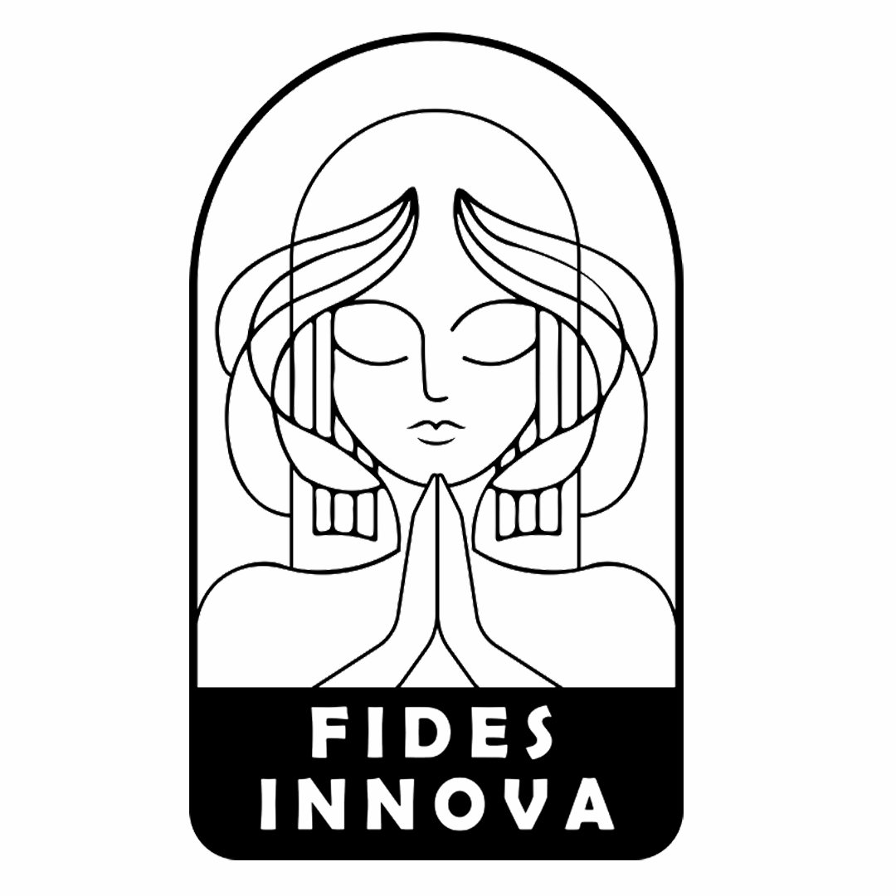

[circleci-image]: https://img.shields.io/circleci/build/github/nestjs/nest/master?token=abc123def456
[circleci-url]: https://circleci.com/gh/nestjs/nest

  
A decentralized platform for trusted Internet-of-Things

    

# FidesInnova: Redefining Security and Trust for the IoT Future
FidesInnova sets a new benchmark for security and trust in the evolving landscape of IoT. Our platform leverages cutting-edge verifiable computing technologies, including zero-knowledge proofs (ZKP) and blockchain, to deliver unparalleled reliability and transparency.
 
## Key Features
<strong>zk-IoT Platform:</strong> At the forefront of our offering, zk-IoT integrates ZKP technology into the IoT domain, redefining standards for decentralized, reliable IoT systems. It ensures the accuracy of firmware execution and facilitates seamless, trustworthy communication between IoT devices.

<strong>Functional-Hiding Commitment Cryptography:</strong> Central to FidesInnova’s architecture is our advanced functional-hiding commitment cryptography algorithm, which underpins the security and integrity of data handling and processing.

<strong>Service Contracts:</strong> Introducing a groundbreaking feature, Service Contracts are customizable, JavaScript-based mini-programs that empower users to effortlessly manage and monetize IoT data. Our Service Market enhances this experience by providing a diverse range of pre-written contracts, expanding the functionalities of IoT devices with ease.

## Ecosystem Components
<strong> IoT Node:</strong> A software package equipped with ZKP-enabled JavaScript execution, acting as the core component for secure and authentic service contract execution. 

<strong> Fides Mobile App:</strong> Available on major app stores, this app provides users with comprehensive control over their IoT devices. 

<strong> Fides Web App:</strong> Designed for service creation and data monetization, it complements the mobile app by offering a robust platform for managing and expanding IoT capabilities. 

FidesInnova isn’t just a platform; it’s a holistic ecosystem that empowers users and enhances their IoT experience through innovative technology and seamless integration.

# FidesInnova Repositories 
#### To access the following repositories, please email info@fidesinnova.io

## A. FidesInnova IoT node 
### The IoT backend of the FidesInnova includes IoT server, web app, admin web app 
#### https://github.com/FidesInnova/iot_node_backend_web_app 

## B. FidesInnova blockchain node
### The FidesInnova blockchain network includes the validator and general nodes
#### [https://github.com/FidesInnova/iot_node_evm](https://github.com/FidesInnova/iot_node_evm)

### C. The FidesInnova mobile app
#### https://github.com/FidesInnova/mobile_app

## D. ZKP-enabled IoT hardware
### D.1. Zero-Knowledge (zk) MultiSensor
The zkMultiSensor is an IoT device that contains a thermometer, hygrometer, door sensor, motion detector, and a smart button. It can send data of the data-gathering environment with a ZKP (Zero-Knowledge Proof). It also supports an IoT mesh network protocol to let devices connect to the Internet without direct Internet access.
#### https://github.com/FidesInnova/hw_fidesinnova_multi_sensor

### D.2. Zero-Knowledge (zk) E-card
The E-card is an electronic business card to demonstrate the zkIoT functionality. The business card includes temperature and humidity sensors and a smart button.
#### https://github.com/FidesInnova/hw_fidesinnova_E-card_ZKP

